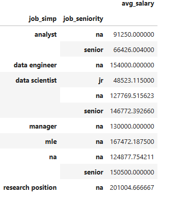
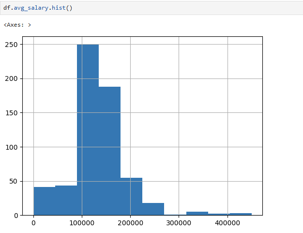
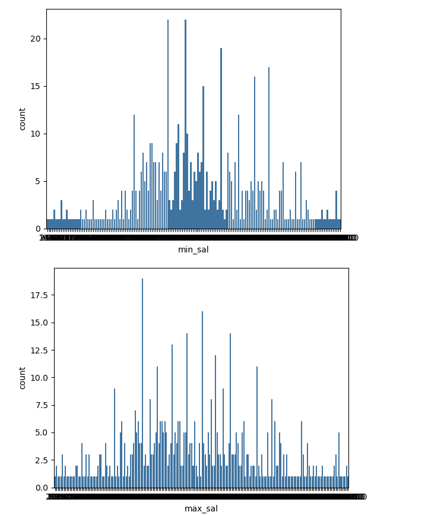

# Data Science Salary Estimator: Project Overview

- Created a tool that estimates data science salaries (MSE ~ $11K) to help data scientists negotiate their income when they get a job.
- Scraped over 1000 job descriptions from glassdoor using python and selenium.
- Engineered features from the text of each job description to quantify the value companies put on python, excel, aws, and spark.
- Optimized Linear, Lasso, and Random Forest Regressors using GridsearchCV to reach the best model.
- 
# Code and Resources Used

- Python Version: 3.7
- Packages: pandas, numpy, sklearn, matplotlib, seaborn, selenium, flask, json, pickle

# Web Scraping

Scrape 600-1000 job postings from glassdoor.com. With each job, we got the following:

- Job title
- Salary Estimate
- Job Description
- Rating
- Company
- Location

- # Data Cleaning

After scraping the data, I needed to clean it up so that it was usable for our model. I made the following changes and created the following variables:

- Parsed numeric data out of salary
- Made columns for employer provided salary and hourly wages
- Removed rows without salary
- Made a new column for company state
- Column for simplified job title and Seniority
  
# Data Cleaning

After scraping the data, I needed to clean it up so that it was usable for our model. I made the following changes and created the following variables:

- Parsed numeric data out of salary
- Made columns for employer provided salary and hourly wages
- Removed rows without salary
- Parsed rating out of company text
- Made a new column for company state

# EDA

I looked at the distributions of the data and the value counts for the various categorical variables. Below are a few highlights from the pivot tables.

